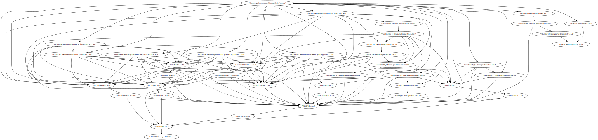

.. Binmap: scanning file systems with Binmap slides file, created by
   hieroglyph-quickstart on Fri Jul  1 13:21:09 2016.

Binmap: scanning file systems with Binmap
=========================================

2016 RMLL Security Track

*Serge Guelton*

Sébastien Renaud

The story of Happy Kitty
========================

Needs to audit a smartphone, where to start?

.. code-block:: console

    $ find / -name '*.so' | \
        while read so; do \
            nm -CD "$so"  | grep strcpy && echo $so ; \
        done

Rince and Repeat
================

Similar commands to find libraries with:

- Hardening features (or without!)

- Sensible functions (``strcpy``, ``system``)

- Dependencies on flaky libraries

Recursively
===========

In the end we may want to build:

- A score for each binary, to focus on some libs

- A graph of library interactions

Binmap
======

A **Simple** Tool that:

- Walks a filesystem
- Analyses Binary files
- Builds the dependency graph

Nothing more ``:-)``

Support
=======

https://github.com/quarkslab/binmap

- Tested on Linux & Windows

- Supported Binary Formats:

    - ELF
    - PE

Usage - Build a Database
========================

.. code-block:: console

    $ binmap scan /usr/local -o local.dat

or

.. code-block:: console

    $ ./binmap scan --chroot ./extracted_fs -o image.dat

The graph + metadata is represented as serialized C++ data structure, ``NoDB™``

Usage - Visualize the Database
==============================

.. code-block:: console

    $ ./binmap view -i local.dat -o local.dot

Usage - Explore the Database
============================

Python binding:

.. code-block:: pycon

    >>> import blobmap

Usage - Explore the Database
============================

Load the db:

.. code-block:: pycon

    >>> blobs = blobmap.BlobMap('local.dat')

And the last scan result:

.. code-block:: pycon

    >>> blob = blobs.last()

Usage - Explore a Node
======================

Inspect nodes:

.. code-block:: pycon

    >>> clang_metadata = blob['/usr/local/bin/clang']
    >>> str(clang_metadata)
    clang: 8fcffc4a97cd4aaa1a32938a9e95d3b253476121(13223 exported symbols)(1303 imported symbols)(1 hardening features)

Usage - Metadata
================

.. code-block:: pycon

    >>> clang_metadata.hash
    8fcffc4a97cd4aaa1a32938a9e95d3b253476121
    >>> clang_metadata.hardening_features
    {'fortified'}

A Note on Versioning
====================

- **No** Standard way to store version number in a binary
- **No** Standard versioning scheme

⇒ regexp on ``.rodata`` :-/

Scenario #1
===========

Find binary that may be interesting:

.. code-block:: pycon

    >>> max(blob.items(), key=lambda item: score(item[1]))

Scenario #1 - Score Function
============================

Using:

.. code-block:: pycon

    >>> LOOKATME = 'strcpy', 'system'
    >>> def score(node):
        return (len(s.imported_symbols.intersection(LOOKATME)) -
                len(s.hardening_features))

Scenario #2
===========

Find all binaries that load a given shared library

Using:

.. code-block:: pycon

    >>> [n.name for n in b.induced_predecessors('/lib32/libc.so.6')]

Scenario #3
===========

Compare two snapshots of a system

.. code-block:: pycon

    >>> blob0, blob1 = list(blobs.values())[-2:]
    >>> diff = blob00.diff(blob1)
    >>> diff.added
    {'/.../libmy1.so'}
    >>> diff.removed
    {'/.../libmy0.so'}
    >>> diff.updated
    {'/.../myprog'}

Technical Points
================

- CMake +CTest +  C++98 (``:'(``) + OpenMP (optional)
- ``Boost.Python``
- Git, Travis…
- Once tried ``sqlite`` as a backend

Final Words
===========

https://github.com/quarkslab/binmap

- Open Source + Plugin System = Contribute
- KISS: a simple tool, build upon it!
- Thanks *a lot* to *happy kitty* for his feedback!

