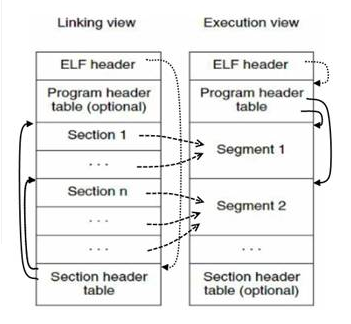

:title: C++ in Elvenland
:data-transition-duration: 150
:skip-help: true
:slide-numbers: true
:css: font.css

C++ in ElvenLand
================

*Serge « sans paille » Guelton <serge.guelton@quarkslab.com>*

CppCon 2018 -- USA / 23 -- 29 September 2018

----

About me
========

- R&D engineer on compilation for security @ QuarksLab
- Associate Researcher at Telecom Bretagne
- Happy developer of `Pythran <https://github.com/serge-sans-paille/pythran>`_
- LLVM commiter

----

Elen síla lúmenn' omentielvo
============================

    *a star shines on the hour of our meeting*

A trip in elven land, with a focus on C++ artefacts.

Many ancient artefacts come from C.

----

Concerning Elves
================

.. image:: ./imgs/silmarrillion.jpg
    :width: 800px

----

The CS View
================

    « A Wyvern, a Gnu or an Orc give birth to an Elf sometimes teamed-up with a Dwarf. »

----

The Elf Format
==============

Used mostly in the (Li|U)nix world by:

    - Object files ``.o``
    - Shared object files ``.o``
    - Core files ``core``
    - Executable ``a.out``

----

A Top Down Approach to Elf
==========================

.. code:: C

    /* hello.c */
    #include <stdio.h>

    int main() {
      puts("Hello CppCon");
      return 0;
    }

.. code:: sh

    > gcc hello.c -o hello

----

``file`` speaks elvish
======================

.. code:: sh

    > file hello
    hello: ELF 64-bit LSB pie executable x86-64, \
           version 1 (SYSV), dynamically linked, \
           interpreter /lib64/ld-linux-x86-64.so.2, \
           for GNU/Linux 3.2.0, \
           BuildID[sha1]=84a84138ec39086f2f7553316c6093e599f8ddd2, \
           not stripped

----

Header
======

``ELF 64-bit``
**************

    There exist two kind of elf blob: the 64bit version and the 32 bit version. This basically determines how addresses and offsets are encoded

----

Header
======

``ELF 64-bit``
**************

    There exist two kind of elf blob: the 64bit version and the 32 bit version. This basically determines how addresses and offsets are encoded

    (image d'un petit et d'un grand elf)

``LSB``
*******

    Least-Significant Byte a.k.a. little endian

----

Header
======

``pie``
*******

    Position Independent Executable, this binary can be loaded at any adress. Plays nice with ASLR

``x86-64``
**********

    The instruction set used by this binary

``version 1``
*************

    There is only one version of the ELF standard anyway

----

Header
======

``SYSV``
********

    *Sys*tem *V* Application Binary Interface, set of sepcs about object format, calling convention etc

``dynamically linked``
**********************

    Not a stand-alone executable, uses shared library and thus needs a...

``interpreter /lib64/ld-linux-x86-64.so.2``
*******************************************

    Dynamic loader

----

Statically linked?
==================

.. code:: sh

    > ldd hello
    linux-vdso.so.1 (0x00007ffed7dd9000) # see ``man 7 vdso``
    libc.so.6 => /lib/x86_64-linux-gnu/libc.so.6 (...)
    /lib64/ld-linux-x86-64.so.2 (0x00007f873c71f000)

.. code:: sh

    > gcc hello.c -static -o hello-static
    > file hello-static
    hello-static: ELF 64-bit LSB executable, x86-64,\
     version 1 (GNU/Linux), statically linked (...)
    > ldd hello-static
    not a dynamic executable

----

Header
======

``for GNU/Linux 3.2.0``
***********************

    The libc ABI we are using

``BuildID[sha1]=84a8413...``
**********************************************************

    same BuildID ~= semantically identical binary, useful as a maintainer to quickly identify a build from a core

``not stripped``
****************

    still has symbol and debug information

----

Summary
=======

.. code:: sh

    > readelf -h hello
    ELF Header:
      Magic:   7f 45 4c 46 02 01 01 00 00 00 00 00 00 00 00 00 
      Class:                             ELF64
      Data:                              2's complement, little endian
      Version:                           1 (current)
      OS/ABI:                            UNIX - System V
      ABI Version:                       0
      Type:                              DYN (Shared object file)
      Machine:                           Advanced Micro Devices X86-64
      Version:                           0x1
      Entry point address:               0x1050
      Start of program headers:          64 (bytes into file)
      Start of section headers:          14688 (bytes into file)
      Flags:                             0x0
      Size of this header:               64 (bytes)
      Size of program headers:           56 (bytes)
      Number of program headers:         11
      Size of section headers:           64 (bytes)
      Number of section headers:         30
      Section header string table index: 29

----

About Stripping
===============

.. code:: sh

    > strip hello
    > readelf -h hello
    (...)
    Number of section headers:         28
    Section header string table index: 27

----

What is a Symbol table anyway?
===============================

.. code:: sh

    > objdump -t hello
    Address |Tags   |section  |algn/sz  |name
    (...)
    0000000       F *UND*     00000000   puts@@GLIBC_2.2.5
    0004030 g       .data     00000000   _edata
    00011f4 g     F .fini     00000000   _fini
    0000000       F *UND*     00000000   __libc_start_main@@GLIBC_2.2.5
    0004020 g       .data     00000000   __data_start
    0000000  w      *UND*     00000000   __gmon_start__
    0004028 g     O .data     00000000   .hidden __dso_handle
    0002000 g     O .rodata   00000004   _IO_stdin_used
    0001180 g     F .text     00000065   __libc_csu_init
    0004038 g       .bss      00000000   _end
    0001050 g     F .text     0000002b   _start
    0004030 g       .bss      00000000   __bss_start
    000115a g     F .text     00000017   main
    0004030 g     O .data     00000000   .hidden __TMC_END__
    0000000  w      *UND*     00000000   _ITM_registerTMCloneTable
    0000000  w    F *UND*     00000000   __cxa_finalize@@GLIBC_2.2.5
    0001000 g     F .init     00000000   _init

----

Why is ``puts`` in an ``*UND*`` section?
========================================

.. code:: sh

    > objdump -T hello
    DYNAMIC SYMBOL TABLE:
    0000000  w   D  *UND*  0000000              _ITM_deregisterTMCloneTable
    0000000      DF *UND*  0000000  GLIBC_2.2.5 puts
    0000000      DF *UND*  0000000  GLIBC_2.2.5 __libc_start_main
    0000000  w   D  *UND*  0000000              __gmon_start__
    0000000  w   D  *UND*  0000000              _ITM_registerTMCloneTable
    0000000  w   DF *UND*  0000000  GLIBC_2.2.5 __cxa_finalize

----

What we have learnt so far
==========================

- ELF is a binary format, made of a header
- It also contains plenty of sections
- And even more symbols
- There is nothing specific to C++ in there

----

Bonus
=====

.. code:: sh

    > file cppcon.png
    cppcon.png: PNG image data, 400 x 400, 8-bit/color RGBA,\
     non-interlaced
    > objcopy --input binary --output elf64-x86-64 \
      --binary-architecture i386 cppcon.png cppcon.o
    > objdump -t cppcon.o
    SYMBOL TABLE:
    0000000 l    d  .data  0000000 .data
    0000000 g       .data  0000000 _binary_cppcon_png_start
    0007c25 g       .data  0000000 _binary_cppcon_png_end
    0007c25 g       *ABS*  0000000 _binary_cppcon_png_size

----

Dissecting an Elf
=================

.. image:: ./imgs/elf-simple.png
    :width: 400px

----

Dissecting an Elf (2)
=====================

----

Segments
========

.. code:: sh

    > readelf --segment hello
    (...)
     Section to Segment mapping:
      Segment Sections...
       00     
       01     .interp 
       02     .interp .note.ABI-tag .note.gnu.build-id .gnu.hash .dynsym .dynstr .gnu.version .gnu.version_r .rela.dyn .rela.plt 
       03     .init .plt .plt.got .text .fini 
       04     .rodata .eh_frame_hdr .eh_frame 
       05     .init_array .fini_array .dynamic .got .got.plt .data .bss 
       06     .dynamic 
       07     .note.ABI-tag .note.gnu.build-id 
       08     .eh_frame_hdr 
       09     
       10     .init_array .fini_array .dynamic .got 

----

Function symbols
================

.. code:: c++

    /* hello.cpp */
    #include <iostream>

    int main() {
      std::iostream << "Hello CppCon" << std::endl;
      return 0;
    }

.. code:: sh

    > g++ hello.cpp -o hello++

----

Symbol mangling
===============

.. code:: sh

    > nm hello++
    (...)
    000118a T main
    00010f0 t register_tm_clones
    0001080 T _start
    0004048 D __TMC_END__
    00011bd t _Z41__static_initialization_and_destruction_0ii
            U _ZNSolsEPFRSoS_E@@GLIBCXX_3.4
            U _ZNSt8ios_base4InitC1Ev@@GLIBCXX_3.4
            U _ZNSt8ios_base4InitD1Ev@@GLIBCXX_3.4
    0004060 B _ZSt4cout@@GLIBCXX_3.4
            U _ZSt4endlIcSt11char_traitsIcEERSt13basic_ostreamIT_T0_ES6_@@GLIBCXX_3.4
    0002004 r _ZStL19piecewise_construct
    0004171 b _ZStL8__ioinit
            U _ZStlsISt11char_traitsIcEERSt13basic_ostreamIcT_ES5_PKc@@GLIBCXX_3.4

----

Symbol demangling
=================

.. code:: sh

    > nm -C hello++
    (...)
    000118a T main
    00010f0 t register_tm_clones
    0001080 T _start
    0004048 D __TMC_END__
    00011bd t __static_initialization_and_destruction_0(int, int)
            U std::ostream::operator<<(std::ostream& (*)(std::ostream&))@@GLIBCXX_3.4
            U std::ios_base::Init::Init()@@GLIBCXX_3.4
            U std::ios_base::Init::~Init()@@GLIBCXX_3.4
    0004060 B std::cout@@GLIBCXX_3.4
            U std::basic_ostream<char, std::char_traits<char> >& std::endl<char, std::char_traits<char> >(std::basic_ostream<char, std::char_traits<char> >&)@@GLIBCXX_3.4
    0002004 r std::piecewise_construct
    0004171 b std::__ioinit
            U std::basic_ostream<char, std::char_traits<char> >& std::operator<< <std::char_traits<char> >(std::basic_ostream<char, std::char_traits<char> >&, char const*)@@GLIBCXX_3.4

----

Fun with Mangling
=================

.. code:: C++

    /* mangling.cpp */
    extern "C" int foo(int);
    int foobar(int);
    int bar(int x) {
        return foo(x) + foobar(x);
    }

.. code:: sh

    > g++ -c mangling.cpp
    > nm mangling.o
                     U foo
                     U _GLOBAL_OFFSET_TABLE_
    0000000000000000 T _Z3bari
                     U _Z6foobari

----

Fun with Mangling 2
===================

.. code:: C

    /* mangling_companion.c */
    int foo(int x) {
        return x;
    }
    int _Z3bari(int x) {
        return x;
    }

Definitively non-portable but valid :-)

----

Constant Symbols
================

.. code:: c++

    /* constants.cpp */
    #include <tuple>

    int const some_int = 1;
    std::tuple<int, float> const some_tuple{1, 2.};

.. code:: sh

    > gcc -O2 constants.cpp -c
    > nm constants.o
    > nm -D constants.o
    nm: constants.o: no symbols

----

Extern Constant symbols
=======================

.. code:: c++

    /* extern_constants.cpp */
    #include <tuple>

    extern int const some_int = 0;
    extern std::tuple<int, float> const some_tuple{1, 2.};

.. code:: sh

    > gcc -O2 extern_constants.cpp -c
    > nm extern_constants.o
    00000008 R some_int
    00000000 R some_tuple

----

About Symbol conflict
=====================

.. code:: c++

    /* noinline0.cpp */
    int foo() { return 0; }
    int bar0() { return foo(); }
    /* noinline1.cpp */
    int foo() { return 0; }
    int bar1() { return foo(); }

.. code:: sh

    > g++ -c noinline0.cpp ; g++ -c noinline1.cpp
    > g++ noinline[01].o -shared
    /usr/bin/ld: noinline1.o: in function `foo()':
    noinline1.cpp:(.text+0x0): multiple definition of `foo()'; noinline0.o:noinline0.cpp:(.text+0x0): first defined here

----

About the ``inline`` keyword
============================

.. code:: c++

    /* inline0.cpp */
    inline int foo() { return 0; }
    int bar0() { return foo(); }
    /* inline1.cpp */
    inline int foo() { return 0; }
    int bar1() { return foo(); }

.. code:: sh

    > g++ -c inline0.cpp ; g++ -c inline1.cpp
    > g++ inline[01].o -shared
    > nm inline0.o
    00000000 W _Z3foov
    00000000 T _Z4bar0v
    > nm noinline0.o
    O0000000 T _Z3foov
    0000000b T _Z4bar0v

----

Other ``weak`` usage
====================

.. code:: c++

    /* inlinemethod0.cpp */
    struct foo { int get() {return 0; } };
    int bar0() { return foo().get(); }
    /* inlinemethod1.cpp */
    struct foo { int get() {return 0; } };
    int bar1() { return foo().get(); }

.. code:: sh

    > g++ -c inlinemethod0.cpp ; g++ -c inlinemethod1.cpp
    > g++ inlinemethod[01].o -shared
    > nm inlinemethod0.o
    nm inlinemethod0.o
    00000000 T _Z4bar0v
    00000000 W _ZN3foo3getEv

----

Another reading of ODR
======================

1. Pick any of the defined symbol
2. normal linkage is stronger than weak linkage

.. code:: sh

    > nm -D  /lib/x86_64-linux-gnu/libc.so.6 | grep ' W '
    (...)
    00039550 W random
    (...)

----

What we have learnt so far
==========================

0. C++ supports overloads through name mangling
1. Different keywords control different symbol type
2. ODR and inline implie weak type

----

Bonus: A new random number generator
====================================

.. code:: c++

    /* random.cpp */
    #include <cstdlib>
    long int random(void) {
        return 0L;
    }
    int main() {
        return random();
    }

.. code:: sh

    > g++ random.cpp -static -o random_static
    > g++ random.cpp -o random

----

``.text`` section
=================

.. code:: sh

    > objdump -t hello | grep main
    (...)
    0000115a g     F .text  00000017
    > readelf -W -t hello
     [Nr] Name
       Type           Address  Off    Size   ES   Lk Inf Al
       Flags
    (...)
     [ 3] .text
      PROGBITS        00000000 000058 000000 00   0   0  1
      [00000006]: ALLOC, EXEC

----

``.data`` and ``.rodata`` sections
==================================

.. code:: c++

    /* data.cpp */
    int some_data0 = 7;
    extern int const some_data1 = 1024;

.. code:: sh

    > g++ data.cpp -c
    > objdump -Ct data.o | grep some_data
    00000000 g     O .data    00000004 some_data0
    00000000 g     O .rodata  00000004 some_data1
    > objdump -s -j.data data.o
    (...)
    Contents of section .data:
    0000 07000000

----

What about ``std::vector`` initialization?
==========================================

.. code:: c++

    /* vector.cpp */
    #include <vector>
    std::vector<char> some_data = \
        { 'c', 'p', 'p', 'c', 'o', 'n' };

.. code:: sh

    > g++ vector.cpp -O2 -c
    > objdump -Ct vector.o | grep some_data
    00000000 l     F .text.startup  0000008f _GLOBAL__sub_I_some_data
    00000000 g     O .bss           00000018 some_data

----

``.bss`` section
================

.. code:: sh

    > readelf -Wt vector.o
     [Nr] Name
       Type          Address  Off    Size   ES   Lk Inf Al
       Flags
    (...)
    [ 5] .bss
     NOBITS          00000000 000060 000018 00   0   0 16
     [00000003]: WRITE, ALLOC

----

Where is my data?
=================

.. code:: sh

    > objdump -s -j.rodata vector.o
    Contents of section .rodata:
     0000 63707063 6f6e                        cppcon

----

Random sections: ``.comment``
=============================

.. code:: sh

    > readelf -Wt hello
      [16] .comment
       PROGBITS        00000000 000138 00001e 01   0   0  1
       [00000030]: MERGE, STRINGS

    > objdump -s -j.comment hello
    (...)
    Contents of section .comment:
     0000 4743433a 20284465 6269616e 20372e33  GCC: (Debian 7.3
     0010 2e302d32 34292037 2e332e30 00        .0-24) 7.3.0.

----

What we have learnt so far
==========================

1. There a re plenty of sections in a sectionned ELF
2. Several c++ concepts clearly map to a given section
3. Different section behave differently with respect to linkage and execution

----

Bonus: updating a section content
=================================

.. code:: sh

    > printf "\o\ cppcon /o/" > ucomment
    > objcopy --update-section .comment=ucomment hello
    > objdump -s -j.comment hello
    (...)
    Contents of section .comment:
     0000 5c6f5c20 63707063 6f6e202f 6f2f      \o\ cppcon /o/

----

Bonus: LTO and ELF
==================

.. code:: sh

    > gcc -c -flto hello.c
    > readelf -t hello.o | grep lto
     [ 4] .gnu.lto_.inline.59f9e5d1fd5ce1d0
     [ 5] .gnu.lto_main.59f9e5d1fd5ce1d0
     [ 6] .gnu.lto_.symbol_nodes.59f9e5d1fd5ce1d0
     [ 7] .gnu.lto_.refs.59f9e5d1fd5ce1d0
     [ 8] .gnu.lto_.decls.59f9e5d1fd5ce1d0
     [ 9] .gnu.lto_.symtab.59f9e5d1fd5ce1d0
     [10] .gnu.lto_.opts
    > objdump -S -j.gnu.lto_main.59f9e5d1fd5ce1d0 hello.o
    (...)
    0000000000000000 <.gnu.lto_main.59f9e5d1fd5ce1d0>:
     0: 78 9c                   js     0xffffffffffffff9e
     2: 65 50                   gs push %rax
     4: bb 4a 03 51 10          mov    $0x1051034a,%ebx
     9: 9d                      popfq
     a: b3 b3                   mov    $0xb3,%bl
     c: 59                      pop    %rcx
     d: 03 21                   add    (%rcx),%esp
     f: da 8a 6c b1 29 52       fimull 0x5229b16c(%rdx)
    15: c4 c2 9f 88             (bad)

----

Bonus: LTO and Clang
====================

.. code:: sh

    > clang -c -flto hello.c
    > readelf -t hello.o
    readelf: Error: Not an ELF file - it has the wrong magic bytes at the start
    > file hello.o
    hello.o: LLVM IR bitcode
    > llvm-dis hello.o -o -
    ; ModuleID = 'hello.o'
    source_filename = "hello.c"
    target datalayout = "e-m:e-i64:64-f80:128-n8:16:32:64-S128"
    target triple = "x86_64-pc-linux-gnu"

    @.str = private unnamed_addr constant [13 x i8] c"Hello CppCon\00", align 1

    ; Function Attrs: noinline nounwind optnone uwtable
    define i32 @main() #0 {
      %1 = alloca i32, align 4
      store i32 0, i32* %1, align 4
      %2 = call i32 @puts(i8* getelementptr inbounds ([13 x i8], [13 x i8]* @.str, i32 0, i32 0))
      ret i32 0
    }

----

Debug information
=================

.. code:: sh

    > g++ hello.cpp -g -o hello++
    > readelf -t hello++ | grep debug
      [27] .debug_aranges
      [28] .debug_info
      [29] .debug_abbrev
      [30] .debug_line
      [31] .debug_str
    > objdump -s -j.debug_str hello++
    (...)
    Contents of section .debug_str:
     0000 67657465 6e760075 696e745f 66617374  getenv.uint_fast
     0010 31365f74 005f5f64 65627567 00696e74  16_t.__debug.int
     0020 5f705f63 735f7072 65636564 6573005f  _p_cs_precedes._
     0030 5a4e5374 31355f5f 65786365 7074696f  ZNSt15__exceptio
     0040 6e5f7074 72313365 78636570 74696f6e  n_ptr13exception
    (...)

----

Debug information
=================

.. code:: sh

    > readelf --debug-dump=info hello++
    Contents of the .debug_info section:

      Compilation Unit @ offset 0x0:
       Length:        0x2867 (32-bit)
       Version:       4
       Abbrev Offset: 0x0
       Pointer Size:  8
     <0><b>: Abbrev Number: 1 (DW_TAG_compile_unit)
        <c>   DW_AT_producer    : (indirect string, offset: 0x5f2): GNU C++14 7.3.0 -mtune=generic -march=x86-64 -g
        <10>   DW_AT_language    : 4        (C++)
        <11>   DW_AT_name        : (indirect string, offset: 0x12c4): hello.cpp
        <15>   DW_AT_comp_dir    : (indirect string, offset: 0x1c0): /home/serge/sources/talks/cppcon2018/elvenland
        <19>   DW_AT_low_pc      : 0x118a
        <21>   DW_AT_high_pc     : 0x91
        <29>   DW_AT_stmt_list   : 0x0

----

Split or Strip
==============

from ``man 3 strip``

.. code:: sh

    > cp foo foo.full
    > strip --strip-debug foo
    > objcopy --add-gnu-debuglink=foo.full foo

----

Exceptions and ELF
==================

.. code::

    > readelf -t vector.o | grep eh
      [18] .eh_frame
      [19] .rela.eh_frame

``.eh_frame`` describes the call frames that much be unwound during the processing of an exception

.. code::

    > objdump -t vector.o | grep personality
    (...)
    *UND*   0000000000000000 __gxx_personality_v0

``__gxx_personality_v0``  serves as an interface between the system unwind library and language-specific exception handling semantics.

----

RTTI and Elf
============

.. code:: c++

    /* rtti.cpp */
    struct Foo { virtual ~Foo(){}};
    struct Bar : Foo {};

    bool is_bar(Foo* f) {
        return dynamic_cast<Bar*>(f);
    }

.. code:: sh

    > g++ -c rtti.cpp
    > objdump -Ct rtti.o | grep typeinfo
    00000000  w    O .data.rel.ro._ZTI3Bar  00000018 typeinfo for Bar
    00000000  w    O .data.rel.ro._ZTI3Foo  00000010 typeinfo for Foo
    00000000  w    O .rodata._ZTS3Bar       00000005 typeinfo name for Bar
    00000000  w    O .rodata._ZTS3Foo       00000005 typeinfo name for Foo

----

Relocations
===========

.. code:: sh

    > readelf -r hello
    (...)
    Relocation section '.rela.plt' at offset 0x548 contains 1 entry:
      Offset    Info         Type             
      00004018  000200000007 R_X86_64_JUMP_SLO
      ... Sym. Value   Sym. Name + Addend
      ... 000000000000 puts@GLIBC_2.2.5 + 0
    > objdump -S -j.plt hello
    0000000000001030 <puts@plt>:
    1030:   ff 25 e2 2f 00 00       jmpq   *0x2fe2(%rip)        # 4018 <puts@GLIBC_2.2.5>
    1036:   68 00 00 00 00          pushq  $0x0
    103b:   e9 e0 ff ff ff          jmpq   1020 <.plt>

----

Static Initialization order Fiasco, revisited
=============================================

.. code:: c++

    /* fiasco.cpp */
    #include <cstdio>
    static struct foo { foo() { puts("first"); } } first;

.. code:: sh

    > g++  fiasco.cpp -o fiasco
    > objdump -t fiasco
    (...)
    00001165 l     F .text  00000038   \
     __static_initialization_and_destruction_0(int, int)

----

Understanding initialization
============================

.. code:: asm

    0000000000001165 <__static_initialization_and_destruction_0(int, int)>:
        1165:   55                      push   rbp
        1166:   48 89 e5                mov    rbp,rsp
        1169:   48 83 ec 10             sub    rsp,0x10
        116d:   89 7d fc                mov    DWORD PTR [rbp-0x4],edi
        1170:   89 75 f8                mov    DWORD PTR [rbp-0x8],esi
        1173:   83 7d fc 01             cmp    DWORD PTR [rbp-0x4],0x1
    ┌───1177:   75 21                   jne    119a <__static_initialization_and_destruction_0(int, int)+0x35>; jump if not equal
    │   1179:   81 7d f8 ff ff 00 00    cmp    DWORD PTR [rbp-0x8],0xffff
    │┌──1180:   75 18                   jne    119a <__static_initialization_and_destruction_0(int, int)+0x35>; jump if not equal
    ││  1182:   48 8d 3d a8 2e 00 00    lea    rdi,[rip+0x2ea8]        # 4031 <first>
    ││  1189:   e8 24 00 00 00          call   11b2 <foo::foo()>
    ││  118e:   48 8d 3d 9d 2e 00 00    lea    rdi,[rip+0x2e9d]        # 4032 <second>
    ││  1195:   e8 34 00 00 00          call   11ce <bar::bar()>
    └└─╼119a:   90                      nop
        119b:   c9                      leave
        119c:   c3                      ret

----

Stack flags
===========

.. code:: sh

    > readelf -h hello
    (...)
    GNU_STACK      0x00000000 0x00000000  0x00000000
                   0x00000000 0x00000000  RW     0x10

No stack execution :-)

----

Shrinking binaries
==================

.. code:: sh

    > g++ -O2 guess.cpp -o guess && \
        stat --printf="%s\n"  guess
    17504
    > g++ -O2 guess.cpp -o guess -Wl,-strip-all && \
        stat --printf="%s\n"  guess
    14488
    > g++ -Os guess.cpp -o guess -Wl,-strip-all && \
        stat --printf="%s\n"  guess
    14480
    > clang++ -Os guess.cpp -o guess -Wl,-strip-all && \
        stat --printf="%s\n"  guess
    14448
    > strip -R.gnu.version  -R.note.gnu.build-id\
        -R.note.ABI-tag -R.comment -R.gnu.hash\
        -R.eh_frame -R.eh_frame_hdr guess
    > stat --printf="%s\n"  guess
    13920

----

Anar kaluva tielyanna
=====================

    *the sun shall shine Upon your path*

1. The binary abstraction is well respected, you *do not* need to speak elvish
2. When in doubt, have a look at the underlying layer
3. ``man readelf``
4. ``man objdump``

