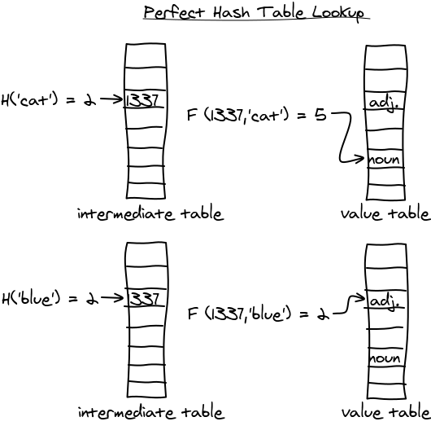

:title: Frozen data structures in C++14
:data-transition-duration: 150
:skip-help: true
:slide-numbers: true
:css: font.css

Frozen data structures in C++14
===============================

*Serge « sans paille » Guelton <serge.guelton@quarkslab.com>*

CppCon 2018 -- USA / 23 -- 29 September 2018

*under the influence of Chris Beck and Jérôme Dumesnil*

*with the great help of Austin McCartney's CMake knowledge*

----

About me
========

- R&D engineer on compilation for security @ QuarksLab
- Associate Researcher at Telecom Bretagne
- Happy developer of `Pythran <https://github.com/serge-sans-paille/pythran>`_
- (modest) LLVM commiter
- Proud father

----

Foreword
========

- All benchmarks are compiled using ``g++ -O2 -std=c++14``

.. code:: sh

    $ g++ --version
    g++ (Debian 7.3.0-11) 7.3.0

- All benchmarks are run on an Intel i7-6600U (i.e. my laptop) using Google benchamrk

----

``const`` means ``.rodata``?
============================

.. code:: c++

    #include <array>
    extern const std::array<int, 4> uktabi =
         { 1, 3, 3, 7 };

.. code:: sh

    $ objdump -S -Mintel -j .rodata uktabi.o
    ...
    Disassembly of section .rodata:

    0000000000000000 <uktabi>:
        0:	01 00 00 00 03 00 00 00 03 00 00 00 07 00 00 00     ................

    $ objdump -S -Mintel -j .text.startup uktabi.o | wc -l
    objdump: section '.text.startup' mentioned in a -j option,\
     but not found in any input file

----

``const`` does not mean no initialization cost!
===============================================

.. code:: c++

    #include <vector>
    extern const std::vector<int> shiv =
        { 1, 3, 3, 7 };

.. code:: sh

    $ objdump -S -Mintel -j .rodata shiv.o
    ...
    Disassembly of section .rodata:

    0000000000000000 <shiv>:
        0:	01 00 00 00 03 00 00 00 03 00 00 00 07 00 00 00     ................

    $ sobjdump -S -Mintel -j .text.startup shiv.o | wc -l
    35

----

What about ``std::set``?
========================

.. code:: c++

    #include <set>
    const std::set<int> nekrataal = { 1, 8, 7 };

.. code:: sh

    $ objdump -S -Mintel -j .rodata a.o
    ...
    0:	01 00 00 00 08 00 00 00 07 00 00 00

    $ objdump -S -Mintel -j .text.startup a.o | wc -l
    74

----

No static equivalent
====================

===================  ============
std::vector          std::array
std::set             ø
std::map             ø
std::unordered_map   ø
std::unordered_set   ø
===================  ============

----

Let it go!
==========

===================  =========================
std::vector          std::array
std::set             **frozen::set**
std::map             **frozen::map**
std::unordered_map   **frozen::unordered_set**
std::unordered_set   **frozen::unordered_map**
===================  =========================

----

``frozen::set``
===============

.. code:: c++

    template <class Key,
              std::size_t N,
              class Compare = std::less<Key>>
    class set;

Rational: a flat sorted ``std::array`` with binary-search.

``Compare`` needs to be ``constexpr``-compatible.

----

``frozen::map``
===============

.. code:: c++

    template <class Key,
              class Value,
              std::size_t N,
              class Compare = std::less<Key>>
    class map;

Same as ``frozen::map`` but stores key, value pairs.

----

``constexpr`` is the new ``const``
==================================

With a ``constexpr`` constructor:

.. code:: c++

    extern constexpr frozen::set<int, 3> nekrataal =
       { 1, 8, 7 };

.. code:: sh

    $ objdump -S -Mintel -j .rodata nekrataal.o
    ...
    0:	00 00 00 00 01 00 00 00 07 00 00 00 08 00 00 00

    $ objdump -S -Mintel -j .text.startup nekrataal.o | wc -l
    objdump: section '.text.startup' mentioned in a -j option, \
        but not found in any input file

----

Same for goes ``map``
=====================

.. code:: c++

    extern constexpr frozen::map<int, bool, 2> suqata =
       { {7, true}, {8, false} };

.. code:: sh

    $ objdump -S -Mintel -j .rodata suqata.o
    ...
    10:	00 00 00 00 07 00 00 00 01 00 00 00 08 00 00 00
    20:	00 00 00 00

    $ objdump -S -Mintel -j .text.startup suqata.o | wc -l
    objdump: section '.text.startup' mentioned in a -j option, \
        but not found in any input file

----

Why? Accelerate the binaries
============================

Sucessively look for all elements in a set of 32 integers:

.. code::

    ------------------------------------------------------------------
    Benchmark                           Time           CPU Iterations
    ------------------------------------------------------------------
    BM_IntInFzSet                         2174 ns       2163 ns     314909
    BM_IntInStdSet                        7401 ns       7371 ns      93767
    BM_IntInStdArray                      3594 ns       3581 ns     195584
    BM_IntInStdArrayBinarySearch          3979 ns       3966 ns     176996

----

Why? Accelerate the binaries
============================

Sucessively look for elements not in a set of 32 integers:

.. code::

    ------------------------------------------------------------------
    Benchmark                           Time           CPU Iterations
    ------------------------------------------------------------------
    BM_IntNotInFzSet                      2168 ns       2162 ns     319424
    BM_IntNotInStdSet                     7668 ns       7649 ns      90889
    BM_IntNotInStdArray                   4811 ns       4800 ns     145907
    BM_IntNotInStdArrayBinarySearch       4000 ns       3992 ns     175349

----

Why? Shrink the binaries
========================

enum style
----------

``.o`` size: **6072** bytes

.. code:: c++

    char const * enum_to_string(RELOC_i386 e) {
      switch(e) {
        case RELOC_i386::R_386_NONE: return "NONE";
        case RELOC_i386::R_386_32: return "R32";
        ...

----

Why? Shrink the binaries
========================

std::map style
--------------

``.o`` size: **8496** bytes

.. code:: c++

    const std::map<RELOC_i386, const char*> e2s = {
        { RELOC_i386::R_386_NONE,          "NONE"},
        { RELOC_i386::R_386_32,            "R32"},
        ...
    };

    char const * enum_to_string(RELOC_i386 e) {
      return e2s.at(e);
    }

----

Why? Shrink the binaries
========================

frozen::map style
-----------------

``.o`` size: **4088** bytes

.. code:: c++

    constexpr frozen::map<RELOC_i386, const char*, 41> e2s = {
        { RELOC_i386::R_386_NONE,          "NONE"},
        { RELOC_i386::R_386_32,            "R32"},
        ...
    };

    char const * enum_to_string(RELOC_i386 e) {
      return e2s.at(e);
    }

----

About Perfect Minimal Hashing
=============================

- *perfect*:

    no collision

- *minimal*

    memory usage in $\mathcal{O}(n)$

``gperf`` implements that.

----

Remember ``gperf``
==================

.. code:: sh

    gperf titan.in > titan.c

.. code::

    // titan.in
    %%
    Coeus
    Crius
    Cronus
    Hyperion
    ...
    Ophion
    Pallas
    Perses
    Prometheus
    Styx
    %%

----

Equivalent in ``frozen``
========================

.. code:: c++

    constexpr frozen::unordered_set<frozen::string, 33> Titans = {
        "Coeus", "Crius", "Cronus", "Hyperion",
        "Iapetus", "Mnemosyne", "Oceanus", "Phoebe",
        "Rhea", "Tethys", "Theia", "Themis",
        "Asteria", "Astraeus", "Atlas", "Aura",
        "Clymene", "Dione", "Helios", "Selene",
        "Eos", "Epimetheus", "Eurybia", "Eurynome",
        "Lelantos", "Leto", "Menoetius", "Metis",
        "Ophion", "Pallas", "Perses", "Prometheus",
        "Styx",
    };

----

Time Comparison
===============

Bad news :-/
------------

gperf generated code may be faster than frozen's ($\times$ 2 or 3)

Good news :-)
-------------

Customization point!

.. code:: c++

    struct olaf {
      constexpr std::size_t operator()(
        frozen::string value,
        std::size_t seed) const
      {
        std::size_t d = seed ^ value.size();
        d = (d + 0x01000193) ^ value[0];
        d = (d + 0x01000193) ^ value[1];
        return d;
      }
    };
    constexpr frozen::unordered_set<frozen::string, 33, olaf> Titans = ...

----

``frozen::unordered_set``
=========================

.. code:: c++

    template <class Key,
              std::size_t N,
              class Hash = elsa<Key>,
              class KeyEqual = std::equal_to<Key>>
    class unordered_set;

Rational: not a one-liner :-)

``Hash`` and ``KeyEqual`` needs to be ``constexpr``

----

``frozen::unordered_map``
=========================

.. code:: c++

    template <class Key,
              class Value,
              std::size_t N,
              class Hash = anna<Key>,
              class KeyEqual = std::equal_to<Key>>
    class unordered_map;

``Hash`` and ``KeyEqual`` needs to be ``constexpr``

----

Why? Accelerate the binaries
============================

Sucessively look for elements in a ``unordered_set`` of 32 strings:

.. code::

    ------------------------------------------------------------------
    Benchmark                           Time           CPU Iterations
    ------------------------------------------------------------------
    BM_StrInFzUnorderedSet           2583 ns       2583 ns     268092
    BM_StrInStdUnorderedSet          4802 ns       4800 ns     145135
    BM_StrInStdArray                 4829 ns       4829 ns     146107

----

Why? Accelerate the binaries
============================

Sucessively look for elements not in an ``unordered_set`` of 32 strings:

.. code::

    ------------------------------------------------------------------
    Benchmark                           Time           CPU Iterations
    ------------------------------------------------------------------
    BM_StrNotInFzUnorderedSet         2619 ns       2619 ns     266644
    BM_StrNotInStdUnorderedSet        4204 ns       4204 ns     166675
    BM_StrNotInStdArray               9392 ns       9392 ns      73318

----

Compile Time Binary Search
==========================

.. code:: cpp

    #include <frozen/set.h>
    constexpr frozen::set<unsigned, 15> primes = {
        2, 3, 5, 7,
        11, 13, 17, 19,
        23, 29, 31, 37,
        41, 43, 47};

    bool is_small_prime(int n) {
      return primes.count(n);
    }

Why is it faster?

----

Compile Time Binary Search
==========================

.. code:: sh

    $ clang a.c -O2 -std=c++14 -c
    $ objdump -S -Mintel -j .text a.o
    0000000000000000 <_Z14is_small_primei>:
       0:	83 ff 13          cmp    $0x13,%edi
       3:	b8 00 00 00 00    mov    $0x0,%eax
       8:	b9 00 00 00 00    mov    $0x0,%ecx
       d:	48 0f 47 c8       cmova  %rax,%rcx
      11:	39 79 0c          cmp    %edi,0xc(%rcx)
      14:	48 8d 41 10       lea    0x10(%rcx),%rax
      18:	48 0f 43 c1       cmovae %rcx,%rax
      1c:	39 78 04          cmp    %edi,0x4(%rax)
      1f:	48 8d 48 08       lea    0x8(%rax),%rcx
      23:	48 0f 43 c8       cmovae %rax,%rcx
      27:	39 39             cmp    %edi,(%rcx)
      29:	48 8d 41 04       lea    0x4(%rcx),%rax
      2d:	48 0f 43 c1       cmovae %rcx,%rax
      31:	b9 00 00 00 00    mov    $0x0,%ecx
      36:	48 39 c8          cmp    %rcx,%rax
      39:	74 06             je     41 <_Z14is_small_primei+0x41>
      3b:	39 38             cmp    %edi,(%rax)
      3d:	0f 96 c0          setbe  %al
      40:	c3                retq
      41:	31 c0             xor    %eax,%eax
      43:	c3                retq

----

Trivia: original code
=====================

.. code:: c++

    template <class ForwardIt, std::size_t N>
    constexpr ForwardIt doit_fast(
        ForwardIt first,
        std::integral_constant<std::size_t, N>)
    {
      auto constexpr step = N / 2;
      static_assert(N/2 == N - N / 2 - 1,
                   "power of two minus 1");
      auto it = first + step;
      auto next_it = compare_(*it, value_)
                     ? it + 1
                     : first;
      return doit_fast(next_it,
        std::integral_constant<std::size_t, N / 2>{});
    }

----

Compile Time Hashing (0)
========================

0. Read the original `blog post by Steve Hanov <http://stevehanov.ca/blog/index.php?id=119>`_

1. Choose a dummy hash function

2. Parametrize it by a random parameter, e.g.

    .. code:: c++

        constexpr std::size_t
        operator()(string value, std::size_t seed) const {
          std::size_t d = seed;
          for (std::size_t i = 0; i < value.size(); ++i)
            d = (d * 0x01000193) ^ value[i];
          return d;
        }

3. Hash all the keys and fill buckets.

----

Compile Time Hashing (1)
========================

4. Starting with the buckets with more collisions, iteratively look for a seed that generates no collision in the final table

5. Store this seed in an intermediate table, and process next bucket

Sounds random? It is! But there's a paper that states it's in :math:`\mathcal{O}(n)`  :-)

----

Compile Time Hashing (2)
========================

*image credits: http://stevehanov.ca/blog/index.php?id=119*

----

Details
=======

----

Details: buckets
================

How to design a container that can grow while staying ``constexpr``?

.. code:: c++

    template <class T, std::size_t N>
    class cvector {
      T data [N] = {};
      std::size_t dsize = 0;
      ...
    };

----

Details: ``std::array`` and ``constexpr``
=========================================

Problems:

1. No ``constexpr`` version of ``operator const``
2. Does *not* gracefully degrades when ``N == 0``.

----

Details: ``random`` and ``constexpr``
=========================================

Problems:

1. The hash algorithm uses randomness
2. The termination proof requires a decent PRNG

**→** Once the seed is fixed, a PRNG is 100% ``constexpr`` compatible.

----

Details: Initialization
=======================

.. code:: c++

    std::map<unsigned, char> mesa =
        {{1, '1'}, {2, '2'}};
    frozen::map<unsigned, char, 2> serra =
        {{1, '1'}, {2, '2'}};

Problem:

1. How to report size mismatch?

----

Details: Error Reporting
========================

.. code:: c++

    template<size_t N>
    constexpr void init(std::initializer_list<int> s) {
        // not ok: `s' is not a constant expression
        static_assert(N == s.size(), "size mismatch");
        // ok with recent compilers
        assert(N == s.size() && "size mismatch");
    }

----

Details: Exception support
==========================

Should a header-only library force a dependency on exceptions?

cf. specification of ``map::at``

.. code:: c++

    #if defined(FROZEN_NO_EXCEPTIONS) ||\
        (defined(_MSC_VER) && !defined(_CPPUNWIND)) ||\
        (defined(__cpp_exceptions) && __cpp_exceptions)

    #include <cstdlib>
    #define FROZEN_THROW_OR_ABORT(_) std::abort()

    #else

    #include <stdexcept>
    #define FROZEN_THROW_OR_ABORT(err) throw err

    #endif

----

Use Cases
=========

----

Use Case: string ⋄ enum
=======================

.. code:: c++

    constexpr
    frozen::map<frozen::string, c_keyword, 32>
    Keywords{
        {"auto", KW_AUTO},
        {"break", KW_BREAK},
        ...
        {"volatile", KW_VOLATILE},
    };

----

Use Case: Parsing
=================

.. code:: c++

    struct codes_t {
        uint32_t iCodepoint1;
        uint32_t iCodepoint2{0};
    };

    constexpr std::pair<frozen::string, codes_t>
    s_Entities[] {
        { "AElig", {     0xC6 }},
        // +2000 entities here
        { "zwnj" , {   0x200C }},
    };

    constexpr auto s_NamedEntitiesHTML4 =
        frozen::make_unordered_map(s_Entities);

----

Use Case: Static Config
========================

    Date: Wed, 28 Mar 2018 15:21:51 +0000
    From: Chris Beck <xxxxxxxxx>
    To: serge guelton <yyyyyyyy>
    Subject: Re: Frozen use at Tesla

    Tesla autopilot uses shared memory segments (...).

    At time of writing, we have an enum that describes all of the different shared memory segments
    used by different parts of the program, and a struct that describes the
    configuration of each segment – (...).

    In the past we had a ``const std::map`` for this. Now we use a ``frozen::map``,
    which simplifies the startup of the tasks.

----

Use Case: Partial Memoization
=============================

.. code:: cpp

    template<class F, class T, T... Vs>
    struct memoized {

      auto operator()(T v) const
      {
        static constexpr frozen::map<T,
                                     decltype(F{}(v)),
                                     sizeof...(Vs)>
        cached = {{Vs, F{}(Vs)}...};
        auto where = cached.find(v);
        if(where != cached.end()) {
          return where->second;
        }
        return F{}(v);
      }
    };

----

Bonus: Use Frozen in a meta program
===================================

All methods calls are ``constexpr`` thus...

.. code:: c++

    #include <frozen/set.h>

    static constexpr frozen::set<unsigned, 3>
    supported_sizes = {
      1, 2, 4
    };

    static_assert(supported_sizes.count(sizeof(long)),
                  "unsupported size");

----

Bonus: Did you know these flags?
================================

- gcc ``-fconstexpr-depth=N``:

    Set the maximum nested evaluation depth for C++11 constexpr functions to N.

- gcc ``-fconstexpr-loop-limit=N``:

    Set the maximum number of iterations for a loop in C++14 constexpr functions to N.

- clang ``-fconstexpr-steps=N``:

    Maximum number of steps in constexpr function evaluation

- (...)

----

Generalize the idea
===================

Frozen containers actually have two characteristics:

1. A (possibly) non-trivial initialization step on constant data
2. A runtime step, on live or constant data

The C++ compiler can make step 1. :math:`\mathcal{O}(1)` and depending on the context, step 2. too.

**Any other algorithms that work that way?**

*yes, algorithms with a precomputed table, like...*

----

Compile Time initialization of string search
============================================

From c++17

.. code:: c++

    std::search(in.begin(), in.end(),
                std::boyer_moore_searcher(needle.begin(),
                                          needle.end())

Make the init phase constexpr!

.. code:: c++

    std::string haystack = "ABC ABCDAB ABCDABCDABDE";
    auto index = frozen::search(
        haystack.begin(), haystack.end(),
        frozen::make_boyer_moore_searcher("ABCDABD")
    );

*see also* the regexp talk by Hana Dusíková

----

Frozen in LIEF
==============

LIEF - Library to Instrument Executable Formats https://lief.quarkslab.com

- Uses Frozen for fast and efficient storage of enums
- Plan to use Frozen for fast ``memmem`` on binary data.

----

Frozen @ Tesla
==============

Contributor to the project!

Uses frozen for:

- Various enum interactions
- Static configuration storage
- Avoid SIOF

----

Frozen @ home
=============

Store a colormap:

.. code:: cpp

    constexpr
    frozen::map<char, std::array<char, 3>, 5>
    ColorMap{
        {'R', {(char)0xFF, (char)0x00, (char)0x00}},
        {'G', {(char)0x00, (char)0xFF, (char)0x00}},
        {'B', {(char)0x00, (char)0x00, (char)0xFF}},
        {'#', {(char)0x00, (char)0x00, (char)0x00}},
        {' ', {(char)0xFF, (char)0xFF, (char)0xFF}},
    }

----

Frozen @ home
=============

And use it to turn ASCIIART into PPM *at compile time*

.. code:: cpp

    constexpr unsigned char bytes[] =
        "      ######      "
        "    ##GGGG  ##    "
        "   #  GGGG    #   "
        "  #  GGGGGG    #  "
        "  # GG    GG   #  "
        " #GGG      GGGGG# "
        " #GGG      GG  G# "
        " # GG      G    # "
        " #  GG    GG    # "
        " #  GGGGGGGGG  G# "
        " # GG########GGG# "
        "  ###  #  #  ###  "
        "   #   #  #   #   "
        "   #          #   "
        "    #        #    "
        "     ########     "
    };

----

----

Credits
=======

Thanks to Quarkslab for allowing me to spend time on that project.

*Kudos* to Chris Beck and  Jérôme Dumesnil for the common work!

.. code:: sh

    $ lynx https://github.com/serge-sans-paille/frozen

