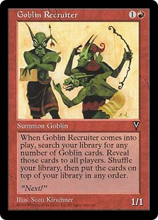

:title: vim include/llvm/* , quelques pépites glanées en maintenant LLVM
:data-transition-duration: 150
:skip-help: true
:slide-numbers: true
:css: font.css

``vim include/llvm/*`` , quelques pépites glanées en maintenant LLVM
====================================================================

**Serge « sans paille » Guelton**

Compiler Engineer / Wood Craft Lover / RedHat employee

*CppFrug — 29 avril 2021*

----

.. image:: goblin_tinkerer.jpg
    :width: 800

----

``llvm::is_trivially_copy_constructible``
=========================================

.. code:: c++

    template <typename T,
              bool = is_trivially_copy_constructible<T>::value>
    class SmallVectorTemplateBase;

    template <typename T,
              bool = is_trivially_copy_constructible<T>::value>
    class SmallVectorTemplateBase<T, true> {
        void symbol0();
    };

    template <typename T,
              bool = is_trivially_copy_constructible<T>::value>
    class SmallVectorTemplateBase<T, false> {
        void symbol1();
    };

----

.. code:: c++

    template<class T>
    struct test {
        #ifdef __clang__
        static constexpr bool value = true;
        #else
        static constexpr bool value = false;
        #endif
    };

    template<class T,bool=test<T>::value>
    struct A {
        T value;
    };

    template<class T>
    struct A<T, false> {

    };

    int foo(A<int>) {
        return 0;
    }

----

``llvm::is_move_assignable``
============================

.. code:: c++

    template <typename T>
    struct is_move_assignable {
      template<class F>
        static auto get(F*) -> decltype(std::declval<F &>() = std::declval<F &&>(),
                                        std::true_type{});
        static std::false_type get(...);
        static constexpr bool value = decltype(get((T*)nullptr))::value;
    };

    static constexpr bool has_trivial_move_assign =
          is_move_assignable<detail::trivial_helper<T>>::value;

----

L'``union`` fait la force
=========================

.. code:: c++

    template<class T>
    union trivial_helper {
        T t;
    };

Quoting the standard:

    If a union contains a non-static data member with a non-trivial special
    member function (copy/move constructor, copy/move assignment, or
    destructor), that function is deleted by default in the union and needs to
    be defined explicitly by the programmer.

----

``llvm::BitVector``
===================

Gestion de la mémoire à la main ``<3`` :

.. code:: c++

    ~BitVector() { std::free(Bits.data()); }

Optimisation des réallocations :

.. code:: c++

    void clear() { Size = 0; }

----

``llvm::BitVector``
===================

.. code:: c++

   template <class F, class... ArgTys>
   static BitVector &apply(F &&f, BitVector &Out, BitVector const &Arg,
                           ArgTys const &...Args) {
     assert(llvm::all_of(
                std::initializer_list<unsigned>{Args.size()...},
                [&Arg](auto const &BV) { return Arg.size() == BV; }) &&
            "consistent sizes");
     Out.resize(Arg.size());
     for (size_t i = 0, e = Out.NumBitWords(Arg.size()); i != e; ++i)
       Out.Bits[i] = f(Arg.Bits[i], Args.Bits[i]...);
     Out.clear_unused_bits();
     return Out;
   }

----

``clang::LineOffsetMapping::get``
=================================

.. code:: c++

    LineOffsetMapping
    LineOffsetMapping::get(llvm::MemoryBufferRef Buffer,
                           llvm::BumpPtrAllocator &Alloc);

Implémentation standard:

.. code:: c++

   while (I < BufLen) {
     if (Buf[I] == '\n') {
       LineOffsets.push_back(I + 1);
     } else if (Buf[I] == '\r') {
       // If this is \r\n, skip both characters.
       if (I + 1 < BufLen && Buf[I + 1] == '\n')
         ++I;
       LineOffsets.push_back(I + 1);
     }
     ++I;
   }

----

PGO style
=========

.. code:: c++

    while (I < BufLen) {
      if (__builtin_expect((Buf[I] - '\n') <= ('\r' - '\n'), 0)) {
        if (Buf[I] == '\n') {
          LineOffsets.push_back(I + 1);
        } else if (Buf[I] == '\r') {
          // If this is \r\n, skip both characters.
          if (I + 1 < BufLen && Buf[I + 1] == '\n')
            ++I;
          LineOffsets.push_back(I + 1);
        }
      }
      ++I;
    }

----

SSE style
=========

.. code:: c++

      const auto LFs = VBROADCAST('\n');
      const auto CRs = VBROADCAST('\r');

      while (I + sizeof(LFs) + 1 < BufLen) {
        auto Chunk1 = VLOAD(Buf + I);
        auto Cmp1 = VOR(VEQ(Chunk1, LFs), VEQ(Chunk1, CRs));
        unsigned Mask = VMOVEMASK(Cmp1) ;

        if(Mask) {
          unsigned N = __builtin_ctz(Mask);
          I += N;
          Mask >>= N;
          I += ((Buf[I] == '\r') && (Buf[I + 1] == '\n'))? 2 : 1;
          LineOffsets.push_back(I);
        }
        else
          I += sizeof(LFs);
      }

----

BitWord style
=============

Part0 :

.. code:: c++

    template <class T>
    static constexpr inline T likelyhasbetween(T x, unsigned char m,
                                                  unsigned char n) {
      // see http://graphics.stanford.edu/~seander/bithacks.html#HasBetweenInWord
      return (((x) - ~0UL / 255 * (n)) & ~(x) &
              ((x) & ~0UL / 255 * 127) + ~0UL / 255 * (127 - (m))) &
             ~0UL / 255 * 128;
    }

----

BitWord style
=============

Part1 :

.. code:: c++

    do {
      memcpy(&Word, Buf + I, sizeof(Word));
    #if defined(BYTE_ORDER) && defined(BIG_ENDIAN) && BYTE_ORDER == BIG_ENDIAN
      Word = __builtin_bswap64(Word);
    #endif
      // no new line => jump over sizeof(Word) bytes.
      auto Mask = likelyhasbetween(Word, '\n' - 1, '\r'+1 );
      if (!Mask) {
        I += sizeof(Word);
        continue;
      }

----

BitWord style
=============

Part2 :

.. code:: c++

      [...]
      unsigned N = __builtin_ctzl(Mask) - 7;
      Word >>= N;
      I += N / 8 + 1;
      unsigned char Byte = Word;
      if (Byte == '\n') {
        LineOffsets.push_back(I);
      } else if (Byte == '\r') {
        // If this is \r\n, skip both characters.
        if (Buf[I] == '\n')
          ++I;
        LineOffsets.push_back(I);
      }
    }
    while (I < BufLen - sizeof(Word) - 1);

----

``encodeBase64``
================

.. code:: c++

    std::string
    encodeBase64(const llvm::SmallVectorImpl<char> &Bytes)

Dont l'implem contient :

.. code:: c++

    [...]
    uint32_t X = (Bytes[I] << 16) + (Bytes[I + 1] << 8) + Bytes[I + 2];

----

``columnWidthUTF8``
===================

.. code:: c++

    int columnWidthUTF8(StringRef Text) {
      unsigned ColumnWidth = 0;
      unsigned Length;
      for (size_t i = 0, e = Text.size(); i < e; i += Length) {
        Length = getNumBytesForUTF8(Text[i]);

        if (Length <= 0 || i + Length > Text.size())
          return ErrorInvalidUTF8;
        UTF32 buf[1];
        const UTF8 *Start = reinterpret_cast<const UTF8 *>(Text.data() + i);
        UTF32 *Target = &buf[0];
        if (conversionOK != ConvertUTF8toUTF32(&Start, Start + Length, &Target,
                                               Target + 1, strictConversion))
          return ErrorInvalidUTF8;
        int Width = charWidth(buf[0]);
        if (Width < 0)
          return ErrorNonPrintableCharacter;
        ColumnWidth += Width;
      }
      return ColumnWidth;
    }

----

``columnWidthUTF8``
===================

.. code:: c++

        // fast path for ASCII characters
        if (Length == 1) {
          if (!isprintableascii(Text[i]))
            return ErrorNonPrintableCharacter;
          ColumnWidth += 1;
          continue;
        }

----

That's all folks
================

