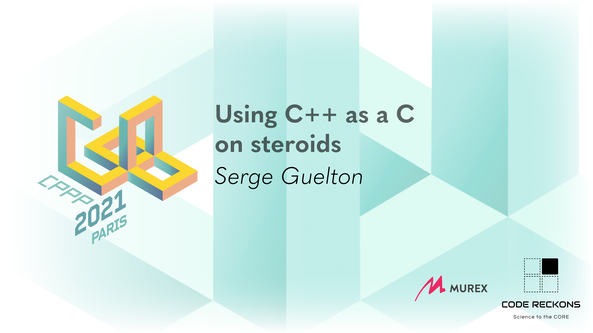

:title: Using C++ as a C on steroids
:data-transition-duration: 150
:skip-help: true
:slide-numbers: true
:css: font.css

----

----

``*this``
=========

Serge « sans paille » Guelton

.. code::

    (gdb) p me
    $1 = {goblin_tinkerer = true, orcish_lumberjack = true,
      monastery_swiftspear = true}

----

Dad's Joke
==========

    ``C++`` is exactly that:

    increment ``C`` and return the old value

----

Abandon your ego
================

- No more runtime type information
- No more exceptions
- No more standard library runtime
- No more standard library headers (?)

----

Removing RTTI
=============

``-fno-rtti``

1. (almost) No more ``dynamic_cast<...>(...)``
2. No more ``typeid(...)``

But keeps the type information needed for exceptions

----

Workaround
==========

 from libcxx

.. code-block:: c++

  template <class _Tp>
  struct  __unique_typeinfo { static constexpr int __id = 0; };
  template <class _Tp> constexpr int __unique_typeinfo<_Tp>::__id;

  template <class _Tp>
  inline
  constexpr const void* __get_fallback_typeid() {
      return &__unique_typeinfo<remove_cv_t<remove_reference_t<_Tp>>>::__id;
  }

----

Removing Exception
==================

 ``-fno-exceptions``

1. No more exception throwing / catching
2. Still register function unwinders

----

Workaround
==========

 from frozen

.. code-block:: c++

    #if (defined(_MSC_VER) && !defined(_CPPUNWIND)) || \
        (!defined(_MSC_VER) && !defined(__cpp_exceptions))

    #include <cstdlib>
    #define FROZEN_THROW_OR_ABORT(_) std::abort()

    #else

    #include <stdexcept>
    #define FROZEN_THROW_OR_ABORT(err) throw err

    #endif

----

Removing the standard library runtime
=====================================

 ``s/g++/gcc`` as linker. Say goodbye to…

1. non-header only types / functions
2. some template functions that are explicitly instantiated
3. language features that require library support
    - default ``new`` / ``delete``
    - in-function static constructors

Placement new is still ok :-)

----

Workaround
==========

.. code-block:: c++

    void* operator new(size_t n) noexcept
    {
        return malloc(n);
    }

    void operator delete(void * p) noexcept
    {
        free(p);
    }

----

Remove (almost) all the things
==============================

 ``-ffreestanding`` (See also: ``-mkernel``)

A few allowed headers, including:

- ``<cstddef>``, ``<limits>``, ``<new>``, ``<initializer_list>``
- ``<type_traits>``, ``<concepts>``

Exceptions and typeid are still in!

- ``<exception>``, ``<typeinfo>``

And most surprisingly

- ``<coroutine>``

----

----

What's left when you gave up everything?
========================================

 A very Cool C language :-)

- ``constexpr``
- ``template<...>``
- ``auto``
- range-based loops
- encapsulation, inheritance (including diamond!)
- stronger typing

----

Three tales
===========

1. GCC
2. LLVM
3. Numpy

----

GCC
===

https://gcc.gnu.org/codingconventions.html

> C++ is a complex language, and we strive to use it in a manner that is not surprising

- conversion
- overload
- operator
- default arguments
- ``<iostream>``
- ``-no-rtti``, ``-no-exceptions``

----

LLVM
====

https://llvm.org/docs/CodingStandards.html

- no static constructors
- no generalized initialization syntax
- beware of copies whith ``auto``
- ``-no-rtti``, ``-no-exceptions``

----

Numpy
=====

PR#19713 (merged)

> Replace numpy custom generation engine by raw C++

- ``-no-rtti``, ``-no-exceptions``
- not linking with standard library

----

``clang-tidy``
==============

- ``cppcoreguidelines``
- ``llvm``

----

Concluding words
================

It's okay to see C++ as a **protean language**

- Pick the feature you want
- Be aware of the dependencies between features
- Document or write tools to enforce your choice

.. image:: goblin_tinkerer.jpg
    :width: 600
