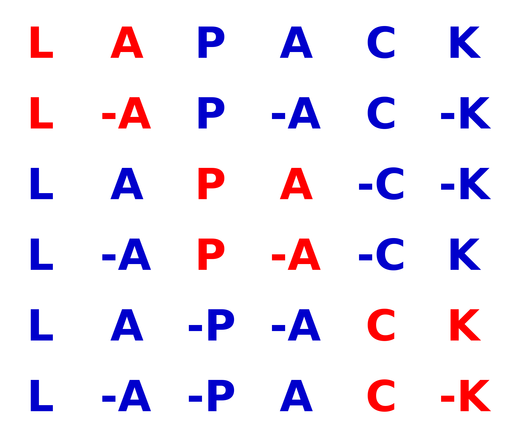
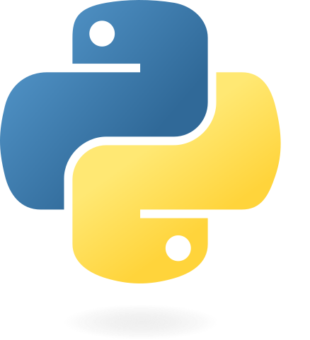

:title: flang and wasm?
:data-transition-duration: 150
:skip-help: true
:slide-numbers: true
:css: font.css

flang + wasm = <3 (?)
=====================

**Serge « sans paille » Guelton**

Compiler Engineer / Story Teller / Wood Chopper

**FOSDEM — 1st February 2025**

----

----

**flang**

----

**fortran**

----

**elder**

----

.. image:: science.png
   :height: 800px

**science**

----

**matrices**

----

**LAPACK**

----

**scipy**

----

**Python**

----

.. image:: education.png
   :width: 1000px

**Education**

----

.. image:: jupyter.png
   :width: 1000px

**Jupyter Notebooks**

----

**WebAssembly**

----

Summary
=======

- People want to run ``scipy`` in the browser
- They want it fast: they use WebAssembly
- Scipy depends on Fortran: use ``flang`` to generate WASM code

----

Problem
=======

Flang is not a cross compiler!

*but*

We can bypass the configuration step:

1. Configure a different host and target

2. Modify the few places where flang assumes ``host == target``

----

Not Sustainable?
================

- Most hacks needed to by-pass ``host == target`` upstreamed
- ``sizeof(integral_type)`` hard-coded and patched downstream

<``/(o_0)\`` >

This is how people currently run R and Python in the browser

<``/(o_0)\`` />

----

Credits
=======

Dr George W Stagg for the original blog post: https://gws.phd/posts/fortran_wasm/#compiling-blas-and-lapack-for-webassembly

Wizards of the Coast for the illustration of *Game of Chaos* and *Elder Land Wurm*

xkcd, «a treasured and carefully guarded point in the space of four-character strings»
