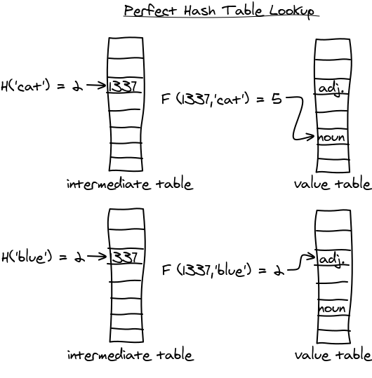

:title: Optimizing the core of Python Scientific Stack
:data-transition-duration: 150
:skip-help: true
:slide-numbers: true
:css: font.css


Frozen data structures meet constexpr
=====================================

*Serge « sans paille » Guelton <serge.guelton@telecom-bretagne.eu>*

Cpp French User Group — Lutèce — mars 2018

*sous l'influence de Chris Beck et Jérôme Dumesnil*

----

About me
========

- R&D engineer on compilation for security @ QuarksLab
- Associate Researcher at Telecom Bretagne
- Happy developer of `Pythran <https://github.com/serge-sans-paille/pythran>`_
- `Soldier of Fortune <http://gatherer.wizards.com/Pages/Card/Details.aspx?name=soldier%20of%20fortune>`_

----

Foreword
========

- All benchmarks are compiled using ``g++ -O2 -std=c++14``

.. code:: sh

    $ g++ --version
    g++ (Debian 7.3.0-11) 7.3.0

- All benchmarks are run on an Intel i7 (i.e. my laptop) using Google benchamrk

----

About Perfect Minimal Hashing
=============================


- *perfect*:

    no collision

- *minimal*

    memory usage in O(n)

``gperf`` implements that.

----

``const`` is not ``.rodata``
============================


.. code:: c++

    const std::set<int> nekrataal = { 1, 8, 7 };

.. code:: sh

    $ objdump -S -Mintel -j .rodata a.o
    ...
    0:	01 00 00 00 08 00 00 00 07 00 00 00

    $ objdump -S -Mintel -j .text.startup a.o | wc -l
    74


----

``constexpr`` is the new ``const``
==================================

.. code:: c++

    extern const frozen::set<int, 3> nekrataal = { 1, 8, 7 };

.. code:: sh

    $ nm a.o
    ...
    0:	00 00 00 00 01 00 00 00 07 00 00 00 08 00 00 00

    $ objdump -S -Mintel -j .text.startup a.o | wc -l
    objdump: section '.text.startup' mentioned in a -j option, \
        but not found in any input file

----

Use Case: string ⋄ enum
=======================

.. code:: c++

    constexpr frozen::map<frozen::string, c_keyword, 32> Keywords{
        {"auto", KW_AUTO},
        {"break", KW_BREAK},
        ...
        {"volatile", KW_VOLATILE},
    };


----

Use Case: Static Config
========================


    Tesla autopilot uses shared memory segments (...).

    At time of writing, we have an enum that describes all of the different shared memory segments
    used by different parts of the program, and a struct that describes the
    configuration of each segment – (...).

    In the past we had a `const std::map` for this. Now we use a frozen::map,
    which simplifies the startup of the tasks.


----

Why? Shrink the binaries
========================

enum style
----------

**6072** bytes

.. code:: c++

    char const * enum_to_string(RELOC_i386 e) {
      switch(e) {
        case RELOC_i386::R_386_NONE: return "NONE";
        case RELOC_i386::R_386_32: return "R32";
        ...

----


Why? Shrink the binaries
========================

std::map style
--------------

**8496** bytes

.. code:: c++

    const std::map<RELOC_i386, const char*> e2s = {
        { RELOC_i386::R_386_NONE,          "NONE"},
        { RELOC_i386::R_386_32,            "R32"},
        ...
    };


    char const * enum_to_string(RELOC_i386 e) {
      return e2s.at(e);
    }

----

Why? Shrink the binaries
========================

frozen::map style
-----------------

**4088** bytes

.. code:: c++

    constexpr frozen::map<RELOC_i386, const char*, 41> e2s = {
        { RELOC_i386::R_386_NONE,          "NONE"},
        { RELOC_i386::R_386_32,            "R32"},
        ...
    };


    char const * enum_to_string(RELOC_i386 e) {
      return e2s.at(e);
    }


----

Why? Accelerate the binaries
============================

Sucessively look for all elements in a set of 32 integers:

.. code::

    ------------------------------------------------------------------
    Benchmark                           Time           CPU Iterations
    ------------------------------------------------------------------
    BM_IntInFzSet                    1672 ns       1672 ns     417271
    BM_IntInStdSet                   5748 ns       5747 ns     119478
    BM_IntInStdArray                 2749 ns       2749 ns     254695

----

Why? Accelerate the binaries
============================

Sucessively look for elements not in a set of 32 integers:

.. code::

    ------------------------------------------------------------------
    Benchmark                           Time           CPU Iterations
    ------------------------------------------------------------------
    BM_IntNotInFzSet                 1668 ns       1667 ns     417931
    BM_IntNotInStdSet                5899 ns       5899 ns     115567
    BM_IntNotInStdArray              3645 ns       3643 ns     192033

----

Why? Accelerate the binaries
============================

Sucessively look for elements in a ``unordered_set`` of 32 strings:

.. code::

    ------------------------------------------------------------------
    Benchmark                           Time           CPU Iterations
    ------------------------------------------------------------------
    BM_StrInFzUnorderedSet           2583 ns       2583 ns     268092
    BM_StrInStdUnorderedSet          4802 ns       4800 ns     145135
    BM_StrInStdArray                 4829 ns       4829 ns     146107


----

Why? Accelerate the binaries
============================

Sucessively look for elements not in an ``unordered_set`` of 32 strings:

.. code::

    ------------------------------------------------------------------
    Benchmark                           Time           CPU Iterations
    ------------------------------------------------------------------
    BM_StrInFzUnorderedSet           2583 ns       2583 ns     268092
    BM_StrInStdUnorderedSet          4802 ns       4800 ns     145135
    BM_StrInStdArray                 4829 ns       4829 ns     146107

----

Compile Time Binary Search
==========================

.. code:: cpp


    #include <frozen/set.h>
    constexpr frozen::set<unsigned, 15> primes = {
        2, 3, 5, 7,
        11, 13, 17, 19,
        23, 29, 31, 37,
        41, 43, 47};

    bool is_small_prime(int n) {
      return primes.count(n);
    }

----

Compile Time Binary Search: Assembly
====================================


Compiler with ``-march=native`` for dense assembly output :-)

.. code:: sh

    $ objdump -S -Mintel -j .text a.o

    Disassembly of section .text:

     0:	83 ff 14             	cmp    edi,0x14
     3:	48 8d 15 00 00 00 00 	lea    rdx,[rip+0x0]
     a:	19 c0                	sbb    eax,eax
     c:	48 8d 4a e0          	lea    rcx,[rdx-0x20]
    10:	83 e0 e2             	and    eax,0xffffffe2
    13:	83 c0 25             	add    eax,0x25
    16:	83 ff 13             	cmp    edi,0x13
    19:	48 0f 46 d1          	cmovbe rdx,rcx
    1d:	39 c7                	cmp    edi,eax
    1f:	48 8d 4a 10          	lea    rcx,[rdx+0x10]
    23:	48 0f 47 d1          	cmova  rdx,rcx
    27:	3b 7a 04             	cmp    edi,DWORD PTR [rdx+0x4]
    2a:	76 04                	jbe    30 <_Z14is_small_primei+0x30>
    2c:	48 83 c2 08          	add    rdx,0x8
    30:	48 8d 42 04          	lea    rax,[rdx+0x4]
    34:	3b 3a                	cmp    edi,DWORD PTR [rdx]
    36:	48 8d 0d 00 00 00 00 	lea    rcx,[rip+0x0]
    3d:	48 0f 47 d0          	cmova  rdx,rax
    41:	31 c0                	xor    eax,eax
    43:	48 39 ca             	cmp    rdx,rcx
    46:	74 05                	je     4d <_Z14is_small_primei+0x4d>
    48:	3b 3a                	cmp    edi,DWORD PTR [rdx]
    4a:	0f 93 c0             	setae  al
    4d:	c3                   	ret


----

Compile Time Hashing, aka ``gperf``
===================================

0. Read the original `blog post by Steve Hanov <http://stevehanov.ca/blog/index.php?id=119>`_

1. Choose a dummy hash function

2. Parametrize it by a random parameter, eg

    .. code:: c++

        constexpr std::size_t operator()(string value, std::size_t seed) const {
          std::size_t d = seed;
          for (std::size_t i = 0; i < value.size(); ++i)
            d = (d * 0x01000193) ^ value[i];
          return d;
        }

----

Compile Time Hashing, aka ``gperf``
===================================



----


Compile Time Hashing, aka ``gperf``
===================================

3. Starting with the buckets with more collisions, iteratively look for a seed that generates no collision in the final table

4. Store this seed in the intermediate table, and process next bucket

Sounds too random? there's a paper that states it's in O(n) :-)

----

Bonus: Use Frozen in a meta program
===================================

All methods calls are ``constexpr`` thus...


.. code:: c++

    #include <frozen/set.h>

    static constexpr frozen::set<unsigned, 3> supported_sizes = {
      1, 2, 4
    };

    static_assert(supported_sizes.count(sizeof(long)), "unsupported size");

----

Bonus: Compile Time initialization of string search
===================================================

From c++17

.. code:: c++

    std::search(in.begin(), in.end(),
                std::boyer_moore_searcher(needle.begin(), needle.end())

Make the init phase constexpr!

.. code:: c++

    std::string haystack = "ABC ABCDAB ABCDABCDABDE";
    auto index = frozen::search(haystack.begin(), haystack.end(),
                                frozen::make_boyer_moore_searcher("ABCDABD"));


----

Frozen in LIEF
==============

LIEF - Library to Instrument Executable Formats https://lief.quarkslab.com

- Uses Frozen for fast and efficient storage of enums
- Plan to use Frozen for fast ``strstr``

----

Frozen @ Tesla
==============

Contributor to the project!

Uses frozen for

- Various enum interactions
- Static configuration storage
- Avoid SIOF

----

Frozen @ home
=============

Store a colormap:

.. code:: cpp

    constexpr frozen::map<char, std::array<char, 3>, 5> ColorMap{
        {'R', {(char)0xFF, (char)0x00, (char)0x00}},
        {'G', {(char)0x00, (char)0xFF, (char)0x00}},
        {'B', {(char)0x00, (char)0x00, (char)0xFF}},
        {'#', {(char)0x00, (char)0x00, (char)0x00}},
        {' ', {(char)0xFF, (char)0xFF, (char)0xFF}},
    }


----

Frozen @ home
=============

And use it to turn ASCIIART into PPM *at compile time*

.. code:: cpp

    constexpr unsigned char bytes[] =
        "      ######      "
        "    ##GGGG  ##    "
        "   #  GGGG    #   "
        "  #  GGGGGG    #  "
        "  # GG    GG   #  "
        " #GGG      GGGGG# "
        " #GGG      GG  G# "
        " # GG      G    # "
        " #  GG    GG    # "
        " #  GGGGGGGGG  G# "
        " # GG########GGG# "
        "  ###  #  #  ###  "
        "   #   #  #   #   "
        "   #          #   "
        "    #        #    "
        "     ########     "
    };

----

Credits
=======

Thanks to Quarkslab for allowing me to sped time on that project.

Kudos to Chris Beck and  Jérôme Dumesnil for the common work!

```
https://github.com/serge-sans-paille/frozen
```

