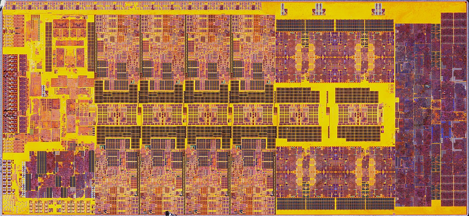
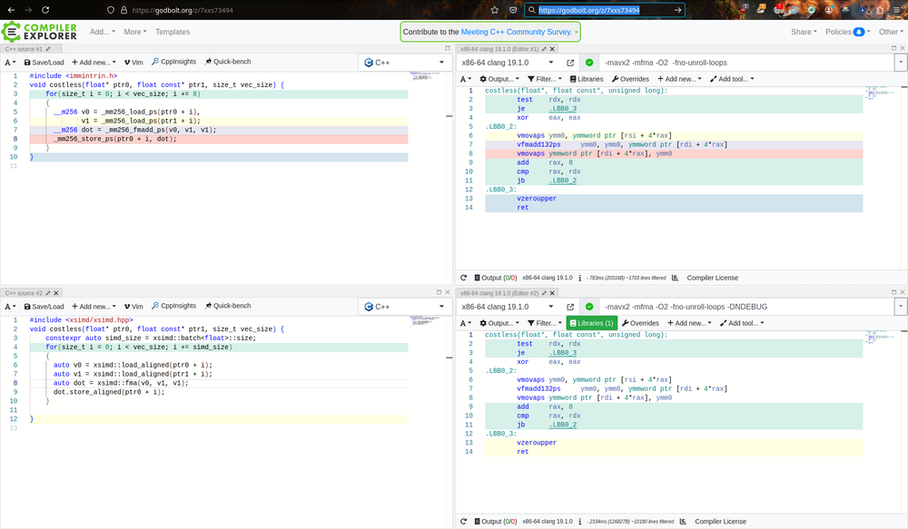

:title: Discover Pythran through 10 code samples
:data-transition-duration: 150
:skip-help: true
:slide-numbers: true
:css: font.css

xsimd: from xtensor to firefox
==============================

**Serge « sans paille » Guelton**

Compiler Engineer / Story Teller / Mozilla employee

**PyData Paris — 25th September 2024**

----

----

#α Vector instruction Unit
==========================

        Raptor Lake die from an i9-13900K

----

#0 SIMD Illustration
====================

.. code::

     [scalar]            [vector]

        X     |  [ x_0 | x_1 | x_2 | x_3 ]
        +     |     +     +     +     +
        X     |  [ y_0 | y_1 | y_2 | y_3 ]
        =     |     =     =     =     =
        Z     |  [ z_0 | z_1 | z_2 | z_3 ]

Important: **Register Width**

----

#1a Where?
==========

- Intel
- ARM
- Wasm
- Power
- RISCV
- GPUs

# basically any modern hardware

----

#1b Where?
==========

- Numpy
- Blas
- Tensorflow
- …

# basically any regular computation-intensive computation

----

----

#2 How? using Intrinsics
========================

.. code-block:: c

    #include <immintrin.h>

    for(size_t i = 0; i < vec_size; i += 8)
    {
      __m256 v0 = _mm256_load_ps(ptr0 + i),
             v1 = _mm256_load_ps(ptr1 + i);
      __m256 dot = _mm256_fmadd_ps(v0, v1, v1);
      _mm256_store_ps(ptr0 + i, dot);
    }

Tedious! Arch-specific!

----

#3 Programming using Intrinsics (again)
=======================================

.. code-block:: c

    #include <arm_neon.h>

    for(size_t i = 0; i < vec_size; i += 8)
    {
      float32x4_t v0 = vld1q_f32(ptr0 + i),
                  v1 = vld1q_f32(ptr1 + i);
      float32x4_t dot = vfmaq_f32(v0, v1, v1);
      vst1q_f32(ptr0 + i, dot);
    }

Same… but different register width, different arch, different names

----

#4a Costless Abstraction
========================

.. code-block:: c++

    #include <xsimd/xsimd.hpp>

    for(size_t i = 0; i < vec_size; i += simd_size)
    {
      auto v0 = xsimd::load_aligned(ptr0 + i);
      auto v1 = xsimd::load_aligned(ptr1 + i);
      auto dot = xsimd::fma(v0, v1, v1);
      dot.store_aligned(ptr0 + i);
    }

Same, but arch-independent

<3 C++

----

#4b Costless?
=============

        https://godbolt.org/z/7xxs73494

----

----

#5a XSIMD - a humble abstraction
================================

- C++ wrapper around ≠ vector instruction set
- Support for:

  - Intel: SSE2 up to AVX512
  - ARM: Neon (32/64), SVE (fixed size)
  - RISCV
  - Wasm
  - CPU fallback
  - Scalar

- Static dispatch based on compiler flags (instruction level)
- Dynamic dispatch based on CPU capability (function level)

**Only 25k of header-only C++11 code**

*originally based on boost simd*

----

#5b XSIMD - or others
=====================

- Google's `highway <https://github.com/google/highway>`_
- Joel Falcou's `eve <https://github.com/jfalcou/eve>`_
- VC's `std::experimental::simd <https://github.com/VcDevel/std-simd>`_

On the way to standardization?

----

#6a Example of static dispatch
==============================

Generic:

.. code-block:: c++

        template <class A, class T, class>
        batch<T, A> ????(batch<T, A> const& self, batch<T, A> const& other, requires_arch<generic>) noexcept
        {
            const auto diffmax = std::numeric_limits<T>::max() - self;
            const auto mindiff = min(diffmax, other);
            return self + mindiff;
        }

----

#6b Example of static dispatch
==============================

AVX512bw:

.. code-block:: c++

    template <class A, class T, class>
    batch<T, A> sadd(batch<T, A> const& self, batch<T, A> const& other, requires_arch<avx512bw>) noexcept
    {
        XSIMD_IF_CONSTEXPR(sizeof(T) == 1)
        {
            return _mm512_adds_epu8(self, other);
        }
        ...
    }

----

#6c Example of dynamic dispatch
===============================

.. code-block:: c++

    #include "sum.hpp"

    // The architecture we want to target.
    using target_archs = xsimd::arch_list<xsimd::avx2, xsimd::sse2>;

    // Create the dispatching function.
    auto dispatched = xsimd::dispatch<target_archs>(sum{});

    // Call the appropriate implementation based on runtime information.
    float res = dispatched(data, 17);

----

----

#7 XSIMD + ???
==============

- Xtensor:

    Provides an SIMD abstraction to array computing

- Pythran:

    Provides a generic SIMD backend to the compiler

- Arrow:

    Provides an SIMD abstraction to array computing

- Krita:

    Write abstracted yet efficient signal processing kernels

----

#8a XSIMD in Firefox!
=====================

Powers some rendering routines

.. code-block:: c++

    xsimd::batch<int16_t, Arch> vectmask(/*...*/shortMask);
    for (; i < vectWalkEnd; i += numUnicharsPerVector) {
        const auto vect =
          xsimd::batch<int16_t, Arch>::load_aligned(str + i);
        if (xsimd::any((vect & vectmask) != 0))
          return i;
    }

----

#8b Example of migration
========================

.. code-block::

   $ git diff 3b8da9bd15c0^..3b8da9bd15c0 --numstat
   10	1	gfx/thebes/gfxAlphaRecovery.cpp
   6	9	gfx/thebes/gfxAlphaRecovery.h
   129	0	gfx/thebes/gfxAlphaRecoveryGeneric.h
   9	0	gfx/thebes/gfxAlphaRecoveryNeon.cpp
   3	124	gfx/thebes/gfxAlphaRecoverySSE2.cpp

----

#8c XSIMD dans FeuRenard!
=========================

Noyau de calcul pour la tranduction dans Firefox: **gemmology**

- Multiplication de matrice de nombres flottants rapide avec perte (wtf AI…)
- Quantisation, transposition et multiplicationd e matrice sont vectoriées
- Tecniquement:

    - Support de SSE2 à AVX(512)VNNI
    - Support de Neon sur ARM 32 et ARM 64 avec l'extension ``i8mm``
    - Et tout ça en suelement 1074 *SLOC*

Basé sur le projet `intgemm <https://github.com/kpu/intgemm>`_

----

#ω Links & References
=====================

- xsimd:

    - https://github.com/xtensor-stack/xsimd
    - https://xsimd.readthedocs.io

- gemmology:

    - https://github.com/mozilla/gemmology

- plouc:

    - ``sguelton@mozilla.com``

- thanks:

    - Johann Mabille, Joël Falcou, Marco Castelluccio
    - QuantStack & Mozilla \o/
